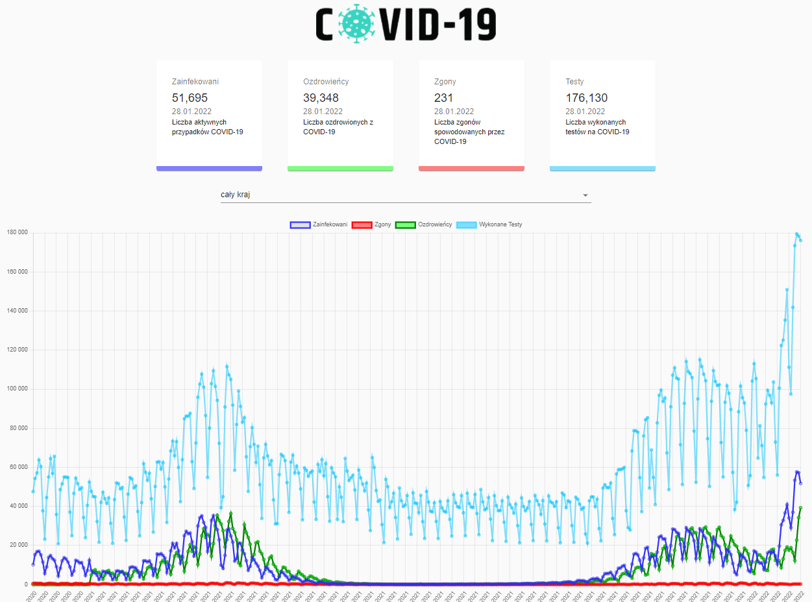
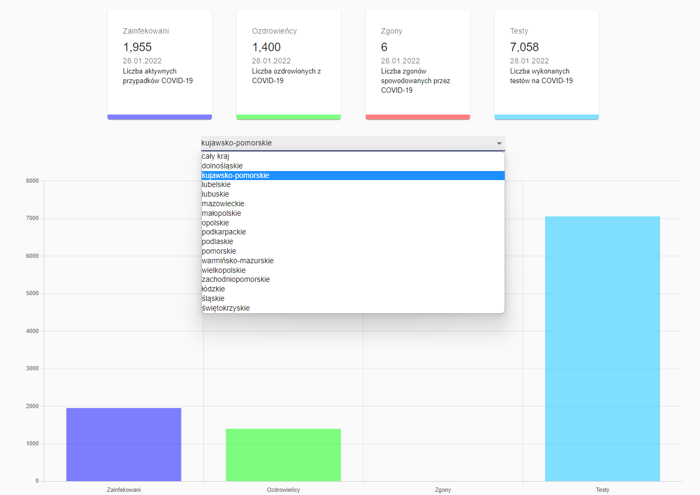
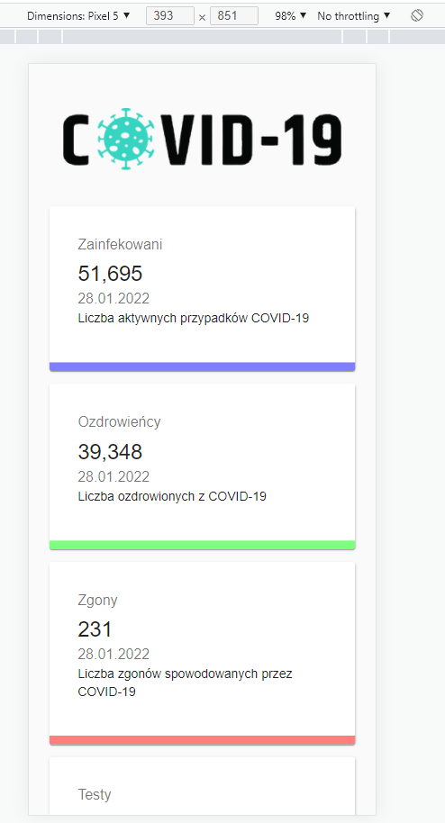
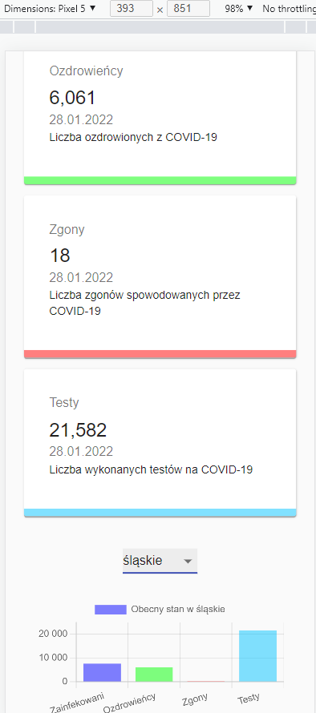

# Coronavirus stats
> This is an application created using the React.js library, allowing for the display of COVID-19 infection statistics in Poland.

## Table of Contents
* [General Info](#general-information)
* [Technologies Used](#technologies-used)
* [Features](#features)
* [Screenshots](#screenshots)
* [Setup](#setup)
* [Project Status](#project-status)
* [Contact](#contact)
* [License](#license)


## General Information
This is an application displaying statistics on COVID-19 cases in Poland. The application retrieves data from a REST API containing official statistics from the Ministry of Health. The application was created in 2022.


## Technologies Used
- React - version 17.0.2
- Axios - version 0.24
- Chart.js - version 3.7.0
- Material UI - version 4.12.3


## Features
List the ready features here:
- Displaying statistics from the last day for the entire country (number of infections, recoveries, deaths, and tests conducted),
- Displaying statistics for a specific region of Poland,
- Statistical charts (line and bar charts),
- Responsiveness.


## Screenshots





## Setup
```bash
$ git clone https://github.com/michu16/coronavirus_stats.git
$ cd project
$ npm install or yarn add
$ npm start
$ open http://localhost:3000/
```

## Project Status
The project is completed, and there are no plans for its further development.


## Contact
Created by Michu16, e-mail: miichusss@gmail.com

## License 
This project is licensed under the MIT License.
